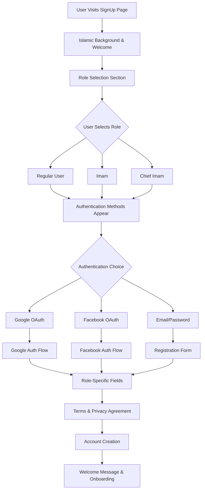

# Islamic Sign Up Page: Award-Winning Design Specification 2025

## Executive Summary

This document outlines the research, design strategy, and technical implementation for a modern, award-winning Sign Up page for an Islamic website. The design incorporates 2025 authentication trends, Islamic cultural elements, and provides a seamless single-page experience for role selection and authentication.

## Table of Contents
1. [Research Findings](#research-findings)
2. [Single-Page Design Strategy](#single-page-design-strategy)
3. [Technical Architecture](#technical-architecture)
4. [Component Specifications](#component-specifications)
5. [Cultural Integration](#cultural-integration)
6. [Implementation Plan](#implementation-plan)

---

## Research Findings

### 2025 Authentication Design Trends (Integrated Research)

#### 1. Passwordless Authentication Integration
**Key Insights:**
- Over 150 million people in the US use passwordless sign-in methods monthly
- Biometric authentication (fingerprint, face ID) as primary options
- Magic link flows with clear visual feedback
- Social login integration as primary authentication method

**Design Implementation:**
- Prominent social authentication buttons (Google, Facebook)
- Clear biometric prompts with device-specific instructions
- Progressive disclosure for traditional email/password fallback
- Visual feedback for authentication state changes

#### 2. Minimalist Single-Page Design
**Core Principles:**
- Clean layouts with reduced visual clutter
- Single-column layouts optimized for mobile-first
- Progressive disclosure to prevent cognitive overload
- Focus on essential elements with generous white space

**Implementation Strategy:**
- Role selection and authentication on same page
- Smooth transitions between sections
- Contextual help and guidance
- Clear visual hierarchy

#### 3. Micro-Animations and Interactions
**Design Applications:**
- Subtle hover effects and button animations
- Progressive form validation feedback
- Smooth state transitions between role selection and auth
- Loading states for social authentication
- Success animations for completed steps

#### 4. Dark Mode and Theme Switching
**Implementation:**
- System preference detection
- Smooth transition animations between themes
- Islamic color palette maintained across themes
- High contrast ratios for accessibility

### Islamic/Religious Design Research

#### Cultural Visual Elements
1. **Geometric Patterns**: Subtle Islamic geometric backgrounds
2. **Color Psychology**: Green (growth, peace), Gold (wisdom), Teal (knowledge)
3. **Typography**: Clean fonts with Arabic script support consideration
4. **Iconography**: Tasteful Islamic symbols without religious imagery overload

#### Trust and Community Values
- Community-focused messaging
- Privacy and security emphasis
- Respectful and inclusive language
- Clear permission explanations for each role

---

## Single-Page Design Strategy

### Page Layout Architecture

```
Islamic Sign Up Page
├── Header Section
│   ├── Logo & Islamic Pattern Background
│   ├── Welcome Message
│   └── Progress Indicator
├── Main Content (Single Scrollable Page)
│   ├── Role Selection Section
│   ├── Authentication Method Section
│   ├── Registration Form Section (Progressive)
│   └── Terms & Privacy Section
├── Trust Indicators Sidebar
└── Footer Links
```

### User Flow on Single Page

#### Step 1: Role Selection (Always Visible)
```
Community Role Selection
├── Regular User Card
├── Imam Card  
└── Chief Imam Card
```

#### Step 2: Authentication Method (Appears After Role Selection)
```
How would you like to join?
├── Google Authentication Button
├── Facebook Authentication Button  
└── Email/Password Option (Expandable)
```

#### Step 3: Progressive Form (Appears Based on Auth Method)
```
Social Auth → Minimal additional info needed
Email Auth → Full registration form
```

### Visual Hierarchy & Layout

#### Desktop Layout (≥1024px)
```
┌─────────────────────────────────────────────────────┐
│                    Header                           │
├─────────────────────────────────────────────────────┤
│  Role Selection  │                                  │
│     Cards        │    Authentication &               │
│                  │    Registration Form             │
│  Trust           │                                  │
│  Indicators      │                                  │
└─────────────────────────────────────────────────────┘
```

#### Mobile Layout (≤768px)
```
┌─────────────────────┐
│      Header         │
├─────────────────────┤
│   Role Selection    │
│       Cards         │
├─────────────────────┤
│   Authentication    │
│     Methods         │
├─────────────────────┤
│  Registration Form  │
├─────────────────────┤
│  Trust Indicators   │
└─────────────────────┘
```

---

## Technical Architecture

### Component Hierarchy

```jsx
SignUpPage
├── SignUpHeader
│   ├── IslamicPatternBackground
│   ├── Logo
│   ├── WelcomeMessage
│   └── ProgressIndicator
├── SignUpContainer
│   ├── RoleSelectionSection
│   │   ├── SectionTitle
│   │   ├── RoleCard (User)
│   │   ├── RoleCard (Imam) 
│   │   └── RoleCard (Chief Imam)
│   ├── AuthenticationSection (Conditional)
│   │   ├── SectionTitle
│   │   ├── SocialAuthButtons
│   │   │   ├── GoogleAuthButton
│   │   │   └── FacebookAuthButton
│   │   ├── Divider ("or")
│   │   └── EmailAuthToggle
│   ├── RegistrationFormSection (Progressive)
│   │   ├── PersonalInfoFields
│   │   ├── AccountDetailsFields
│   │   ├── PasswordFields (if email auth)
│   │   └── RoleSpecificFields
│   └── TermsAndPrivacySection
│       ├── PrivacyPolicyCheckbox
│       ├── TermsOfServiceCheckbox
│       └── SubmitButton
├── TrustIndicatorsSidebar
│   ├── SecurityBadges
│   ├── CommunityStats
│   └── TestimonialQuotes
└── SignUpFooter
    ├── HelpLinks
    └── LanguageSelector
```

### State Management with Redux Toolkit

```javascript
// signupSlice.js
const initialState = {
  // Page State
  currentSection: 'roleSelection',
  selectedRole: null,
  authMethod: null,
  
  // Form Data
  personalInfo: {},
  accountDetails: {},
  roleSpecificData: {},
  
  // UI State
  loading: false,
  errors: {},
  fieldValidation: {},
  
  // Auth State
  isAuthenticated: false,
  authProvider: null,
  socialAuthData: {},
  
  // Progress
  completedSections: [],
  canProceed: false
}

const signupSlice = createSlice({
  name: 'signup',
  initialState,
  reducers: {
    selectRole: (state, action) => {
      state.selectedRole = action.payload
      state.currentSection = 'authentication'
    },
    selectAuthMethod: (state, action) => {
      state.authMethod = action.payload
      state.currentSection = 'registration'
    },
    updateFormData: (state, action) => {
      const { section, data } = action.payload
      state[section] = { ...state[section], ...data }
    },
    setError: (state, action) => {
      const { field, message } = action.payload
      state.errors[field] = message
    },
    clearErrors: (state) => {
      state.errors = {}
    }
  }
})
```

### Single Page Responsive Design

#### CSS Grid Layout
```css
.signup-page {
  display: grid;
  grid-template-columns: 1fr;
  max-width: 1200px;
  margin: 0 auto;
  gap: 2rem;
}

@media (min-width: 1024px) {
  .signup-page {
    grid-template-columns: 2fr 1fr;
  }
  
  .main-content {
    grid-column: 1;
  }
  
  .trust-sidebar {
    grid-column: 2;
    position: sticky;
    top: 2rem;
  }
}
```

---

## Component Specifications

### RoleCard Component

```jsx
const RoleCard = ({ 
  role, 
  title, 
  description, 
  permissions, 
  selected, 
  onClick,
  icon 
}) => {
  return (
    <motion.div
      className={`
        role-card p-6 rounded-2xl border-2 cursor-pointer
        transition-all duration-300 hover:shadow-islamic-lg
        ${selected 
          ? 'border-islamic-500 bg-islamic-50 shadow-islamic-glow' 
          : 'border-gray-200 bg-white hover:border-islamic-300'
        }
      `}
      onClick={() => onClick(role)}
      whileHover={{ scale: 1.02 }}
      whileTap={{ scale: 0.98 }}
      initial={{ opacity: 0, y: 20 }}
      animate={{ opacity: 1, y: 0 }}
    >
      {/* Islamic geometric corner decoration */}
      <div className="absolute top-0 right-0 w-12 h-12 overflow-hidden">
        <IslamicPattern 
          variant="corner-decoration" 
          className="text-islamic-200" 
        />
      </div>
      
      {/* Role Icon */}
      <div className="flex items-center mb-4">
        <div className={`
          w-12 h-12 rounded-xl flex items-center justify-center
          ${selected ? 'bg-islamic-500' : 'bg-gray-100'}
        `}>
          {icon}
        </div>
        <h3 className="text-xl font-bold text-gray-800 ml-4">
          {title}
        </h3>
      </div>
      
      {/* Description */}
      <p className="text-gray-600 mb-4">{description}</p>
      
      {/* Permissions Preview */}
      <div className="space-y-2">
        <p className="text-sm font-semibold text-gray-700">
          What you can do:
        </p>
        <ul className="text-sm text-gray-600 space-y-1">
          {permissions.map((permission, index) => (
            <li key={index} className="flex items-center">
              <Check className="w-4 h-4 text-islamic-500 mr-2" />
              {permission}
            </li>
          ))}
        </ul>
      </div>
      
      {/* Selection Indicator */}
      {selected && (
        <motion.div 
          className="absolute top-4 right-4"
          initial={{ scale: 0 }}
          animate={{ scale: 1 }}
        >
          <div className="w-6 h-6 bg-islamic-500 rounded-full flex items-center justify-center">
            <Check className="w-4 h-4 text-white" />
          </div>
        </motion.div>
      )}
    </motion.div>
  )
}
```

### Role Data Configuration

```javascript
const roleConfig = {
  user: {
    title: "Community Member",
    description: "Join our Islamic community to access resources, participate in discussions, and connect with fellow Muslims.",
    permissions: [
      "Access Islamic resources and articles",
      "Join community discussions",
      "Request duas and spiritual support",
      "Attend virtual events",
      "Edit your personal profile"
    ],
    icon: <User className="w-6 h-6 text-current" />,
    color: "islamic-teal",
    additionalFields: []
  },
  imam: {
    title: "Imam",
    description: "Lead and guide the community with Islamic knowledge, organize events, and provide spiritual guidance.",
    permissions: [
      "All Community Member privileges",
      "Create and manage community events",
      "Write and publish articles",
      "Moderate community discussions",
      "Remove inappropriate content",
      "Access imam resources and tools"
    ],
    icon: <BookOpen className="w-6 h-6 text-current" />,
    color: "islamic",
    additionalFields: ['mosque', 'certification', 'experience', 'specialization']
  },
  chiefImam: {
    title: "Chief Imam",
    description: "Provide administrative oversight, manage imam community, and ensure Islamic authenticity across the platform.",
    permissions: [
      "All Imam privileges",
      "Manage imam accounts and permissions",
      "Access administrative dashboard",
      "Review and approve imam applications",
      "Moderate platform-wide content",
      "Access detailed community analytics"
    ],
    icon: <Crown className="w-6 h-6 text-current" />,
    color: "gold",
    additionalFields: ['mosque', 'certification', 'experience', 'specialization', 'references', 'adminExperience']
  }
}
```

### SocialAuthButton Component

```jsx
const SocialAuthButton = ({ 
  provider, 
  onClick, 
  loading, 
  disabled 
}) => {
  const providerConfig = {
    google: {
      icon: <GoogleIcon />,
      text: 'Continue with Google',
      bgColor: 'bg-white',
      textColor: 'text-gray-700',
      borderColor: 'border-gray-300',
      hoverColor: 'hover:bg-gray-50'
    },
    facebook: {
      icon: <FacebookIcon />,
      text: 'Continue with Facebook',
      bgColor: 'bg-blue-600',
      textColor: 'text-white', 
      borderColor: 'border-blue-600',
      hoverColor: 'hover:bg-blue-700'
    }
  }
  
  const config = providerConfig[provider]
  
  return (
    <motion.button
      onClick={() => onClick(provider)}
      disabled={disabled || loading}
      className={`
        w-full py-4 px-6 rounded-xl font-semibold
        border-2 transition-all duration-300
        flex items-center justify-center gap-3
        hover:shadow-lg hover:-translate-y-0.5
        disabled:opacity-50 disabled:cursor-not-allowed
        ${config.bgColor} ${config.textColor} ${config.borderColor} ${config.hoverColor}
      `}
      whileHover={{ scale: 1.01 }}
      whileTap={{ scale: 0.99 }}
    >
      {loading ? (
        <Loader className="w-5 h-5 animate-spin" />
      ) : (
        <>
          {config.icon}
          {config.text}
        </>
      )}
    </motion.button>
  )
}
```

### ProgressiveFormSection Component

```jsx
const ProgressiveFormSection = ({ 
  selectedRole, 
  authMethod, 
  formData, 
  onUpdate 
}) => {
  // Show different fields based on role and auth method
  const getFieldsForRole = (role) => {
    const baseFields = ['fullName', 'email', 'location']
    
    const roleSpecificFields = {
      user: [],
      imam: ['mosque', 'certification', 'experience'],
      chiefImam: ['mosque', 'certification', 'experience', 'references']
    }
    
    return [...baseFields, ...roleSpecificFields[role]]
  }
  
  return (
    <motion.div
      initial={{ opacity: 0, height: 0 }}
      animate={{ opacity: 1, height: 'auto' }}
      className="space-y-6"
    >
      {/* Islamic decorative header */}
      <div className="text-center">
        <IslamicPattern 
          variant="divider" 
          className="w-24 h-6 mx-auto text-islamic-300 mb-4" 
        />
        <h3 className="text-2xl font-bold text-gray-800">
          Complete Your Profile
        </h3>
        <p className="text-gray-600 mt-2">
          Join our community as a {roleConfig[selectedRole]?.title}
        </p>
      </div>
      
      {/* Progressive Fields */}
      <div className="grid grid-cols-1 md:grid-cols-2 gap-6">
        {getFieldsForRole(selectedRole).map((field) => (
          <FormField
            key={field}
            field={field}
            value={formData[field] || ''}
            onChange={(value) => onUpdate(field, value)}
            required={true}
          />
        ))}
      </div>
      
      {/* Password fields for email auth */}
      {authMethod === 'email' && (
        <div className="grid grid-cols-1 md:grid-cols-2 gap-6">
          <FormField
            field="password"
            type="password"
            value={formData.password || ''}
            onChange={(value) => onUpdate('password', value)}
            required={true}
          />
          <FormField
            field="confirmPassword"
            type="password"
            value={formData.confirmPassword || ''}
            onChange={(value) => onUpdate('confirmPassword', value)}
            required={true}
          />
        </div>
      )}
    </motion.div>
  )
}
```

---

## Cultural Integration

### Islamic Design Elements

#### Color Palette (2025 Enhanced)
```css
:root {
  /* Primary Islamic Colors */
  --islamic-green: #22c55e;
  --islamic-gold: #fbbf24;
  --islamic-teal: #14b8a6;
  
  /* 2025 Enhanced Palette */
  --wisdom-purple: #8b5cf6;
  --peace-blue: #3b82f6;
  --purity-white: #ffffff;
  
  /* Dark Mode Variants */
  --dark-islamic-green: #16a34a;
  --dark-islamic-gold: #f59e0b;
  --dark-surface: #1f2937;
  --dark-text: #f9fafb;
}
```

#### Islamic Typography
```css
/* Arabic-friendly typography */
.islamic-heading {
  font-family: 'Inter', 'Amiri', 'Noto Sans Arabic', sans-serif;
  font-weight: 600;
  line-height: 1.4;
  letter-spacing: -0.025em;
}

.islamic-body {
  font-family: 'Inter', 'Noto Sans', 'Noto Sans Arabic', sans-serif;
  line-height: 1.6;
}

/* RTL Support */
[dir="rtl"] {
  text-align: right;
  direction: rtl;
}
```

#### Geometric Patterns
```jsx
const IslamicPatternBackground = () => (
  <div className="absolute inset-0 opacity-5 pointer-events-none">
    <svg className="w-full h-full" viewBox="0 0 400 400">
      <defs>
        <pattern id="islamic-star" x="0" y="0" width="40" height="40" 
                 patternUnits="userSpaceOnUse">
          <path d="M20,5 L25,15 L35,15 L28,22 L30,32 L20,26 L10,32 L12,22 L5,15 L15,15 Z" 
                fill="currentColor" fillOpacity="0.3"/>
        </pattern>
      </defs>
      <rect width="100%" height="100%" fill="url(#islamic-star)" />
    </svg>
  </div>
)
```

### Cultural Considerations

#### Messaging and Tone
```javascript
const culturalMessaging = {
  welcome: {
    en: "Assalamu Alaykum! Welcome to our community",
    ar: "السلام عليكم! أهلاً بكم في مجتمعنا"
  },
  roleSelection: {
    user: "Join as a community member to access resources and connect",
    imam: "Lead and guide the community with wisdom and knowledge", 
    chiefImam: "Provide spiritual leadership and administrative oversight"
  },
  privacy: "Your privacy is sacred to us, as it is in Islam",
  community: "Join a community built on Islamic values of respect and brotherhood"
}
```

#### Trust Building Elements
```jsx
const TrustIndicators = () => (
  <div className="space-y-6">
    {/* Community Stats */}
    <div className="text-center">
      <h4 className="font-semibold text-gray-800 mb-4">
        Trusted by Our Ummah
      </h4>
      <div className="grid grid-cols-3 gap-4 text-center">
        <div>
          <p className="text-2xl font-bold text-islamic-500">10K+</p>
          <p className="text-sm text-gray-600">Members</p>
        </div>
        <div>
          <p className="text-2xl font-bold text-islamic-500">500+</p>
          <p className="text-sm text-gray-600">Imams</p>
        </div>
        <div>
          <p className="text-2xl font-bold text-islamic-500">50+</p>
          <p className="text-sm text-gray-600">Communities</p>
        </div>
      </div>
    </div>
    
    {/* Security Badges */}
    <div className="space-y-3">
      <div className="flex items-center space-x-3">
        <Shield className="w-5 h-5 text-islamic-500" />
        <span className="text-sm text-gray-600">SSL Encrypted</span>
      </div>
      <div className="flex items-center space-x-3">
        <Lock className="w-5 h-5 text-islamic-500" />
        <span className="text-sm text-gray-600">Privacy Protected</span>
      </div>
      <div className="flex items-center space-x-3">
        <Users className="w-5 h-5 text-islamic-500" />
        <span className="text-sm text-gray-600">Community Verified</span>
      </div>
    </div>
    
    {/* Islamic Quote */}
    <div className="p-4 bg-islamic-50 rounded-xl border-l-4 border-islamic-500">
      <p className="text-sm text-gray-700 italic">
        "And whoever saves a life, it is as if he has saved all of mankind"
      </p>
      <p className="text-xs text-gray-500 mt-2">- Quran 5:32</p>
    </div>
  </div>
)
```

---

## Implementation Plan

### Phase 1: Foundation (Week 1)
- Set up component structure
- Implement design tokens and CSS variables
- Create responsive grid layout
- Set up Redux store for signup state

### Phase 2: Core Components (Week 2)
- Build RoleCard components with animations
- Implement SocialAuthButton components
- Create progressive form sections
- Add Islamic pattern backgrounds

### Phase 3: Authentication Integration (Week 3)
- Integrate Google OAuth
- Integrate Facebook OAuth  
- Add email/password authentication
- Implement form validation

### Phase 4: UX Enhancement (Week 4)
- Add micro-animations and transitions
- Implement dark mode toggle
- Add loading states and error handling
- Optimize for mobile responsiveness

### Phase 5: Cultural Integration (Week 5)
- Add Islamic design elements
- Implement cultural messaging
- Add trust indicators and community stats
- Test with Arabic RTL support

### Performance Optimization Strategy

#### Code Splitting
```javascript
// Lazy load social auth components
const GoogleAuth = lazy(() => import('./components/GoogleAuth'))
const FacebookAuth = lazy(() => import('./components/FacebookAuth'))

// Route-level splitting
const SignUpPage = lazy(() => import('./pages/SignUp'))
```

#### Loading States
```jsx
const LoadingStates = {
  roleSelection: <RoleCardSkeleton />,
  authentication: <AuthButtonSkeleton />,
  registration: <FormSkeleton />,
  submitting: <SubmissionLoader />
}
```

---

## Accessibility Implementation

### WCAG 2.1 AA Compliance

#### Form Accessibility
```jsx
const AccessibleFormField = ({ label, id, error, ...props }) => (
  <div className="mb-4">
    <label 
      htmlFor={id}
      className="block text-sm font-semibold text-gray-700 mb-2"
    >
      {label}
      {props.required && <span className="text-red-500 ml-1">*</span>}
    </label>
    <input
      id={id}
      aria-describedby={error ? `${id}-error` : undefined}
      aria-invalid={error ? 'true' : 'false'}
      className={`
        w-full px-4 py-3 border-2 rounded-xl
        focus:ring-2 focus:ring-islamic-500 focus:border-islamic-500
        ${error ? 'border-red-300' : 'border-gray-300'}
      `}
      {...props}
    />
    {error && (
      <p id={`${id}-error`} className="text-red-500 text-sm mt-1" role="alert">
        {error}
      </p>
    )}
  </div>
)
```

#### Keyboard Navigation
```css
/* Focus management */
.focusable:focus {
  outline: 2px solid var(--islamic-green);
  outline-offset: 2px;
}

/* Skip links */
.skip-link {
  position: absolute;
  top: -40px;
  left: 6px;
  background: var(--islamic-green);
  color: white;
  padding: 8px;
  text-decoration: none;
  border-radius: 4px;
  transition: top 0.3s;
}

.skip-link:focus {
  top: 6px;
}
```

---

## Design Tokens and Specifications

### Spacing System (Golden Ratio Based)
```css
:root {
  /* Islamic golden ratio spacing */
  --space-xs: 0.25rem;    /* 4px */
  --space-sm: 0.5rem;     /* 8px */
  --space-md: 1rem;       /* 16px */
  --space-lg: 1.618rem;   /* 26px - φ */
  --space-xl: 2.618rem;   /* 42px - φ² */
  --space-2xl: 4.236rem;  /* 68px - φ³ */
}
```

### Animation Specifications
```css
/* Islamic-inspired animations */
@keyframes islamicPulse {
  0%, 100% { transform: scale(1); opacity: 1; }
  50% { transform: scale(1.05); opacity: 0.8; }
}

@keyframes geometricRotate {
  from { transform: rotate(0deg); }
  to { transform: rotate(360deg); }
}

.islamic-animation {
  animation: islamicPulse 3s ease-in-out infinite;
}
```

### Component Flow Diagram



---

## Conclusion

This comprehensive design specification creates an award-winning, culturally sensitive, and technically advanced Sign Up page that:

1. **Incorporates 2025 trends**: Passwordless auth, minimalist design, micro-animations
2. **Respects Islamic culture**: Appropriate colors, patterns, and messaging
3. **Provides seamless UX**: Single-page experience with progressive disclosure
4. **Ensures accessibility**: WCAG 2.1 AA compliance and inclusive design
5. **Optimizes performance**: Code splitting, lazy loading, and responsive design

The single-page approach with progressive disclosure ensures users can select their role and authenticate without navigation complexity, while the Islamic design elements create a culturally appropriate and trustworthy experience.

The implementation plan provides a clear roadmap for development, with emphasis on testing, performance, and cultural sensitivity throughout the process.