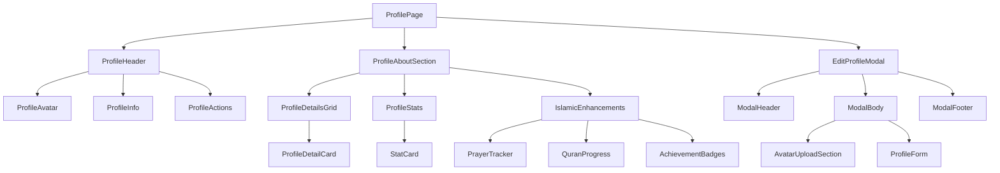

# User Profile Page - React Architecture Plan

## Executive Summary

This document outlines the comprehensive architecture for converting the User Profile Page from HTML to React, incorporating 2025 UI/UX design trends while maintaining an Islamic community theme. The design emphasizes modularity, accessibility, and user engagement through creative Islamic-themed features.

## 1. Technology Stack

### Core Technologies
- **React 18+** - Component framework
- **Tailwind CSS** - Styling with custom Islamic theme
- **lucide-react** - Icon library
- **Redux Toolkit** - State management
- **React Hook Form** - Form handling
- **Framer Motion** - Animations
- **React Query** - API data fetching and caching

### Additional Libraries
- **react-intersection-observer** - Scroll animations
- **react-dropzone** - Avatar upload
- **date-fns** - Date formatting
- **react-hot-toast** - Notifications

## 2. Component Architecture

### File Structure
```
client/src/
├── components/
│   ├── profile/
│   │   ├── ProfilePage.jsx
│   │   ├── ProfileHeader/
│   │   │   ├── index.jsx
│   │   │   ├── ProfileAvatar.jsx
│   │   │   ├── ProfileInfo.jsx
│   │   │   └── ProfileActions.jsx
│   │   ├── ProfileAboutSection/
│   │   │   ├── index.jsx
│   │   │   ├── ProfileDetailsGrid.jsx
│   │   │   ├── ProfileDetailCard.jsx
│   │   │   ├── ProfileStats.jsx
│   │   │   └── StatCard.jsx
│   │   ├── EditProfileModal/
│   │   │   ├── index.jsx
│   │   │   ├── ModalHeader.jsx
│   │   │   ├── ModalBody.jsx
│   │   │   ├── ModalFooter.jsx
│   │   │   ├── AvatarUploadSection.jsx
│   │   │   └── ProfileForm/
│   │   │       ├── BasicInfoSection.jsx
│   │   │       ├── PersonalDetailsSection.jsx
│   │   │       ├── CommunitySection.jsx
│   │   │       └── PrivacySection.jsx
│   │   └── IslamicEnhancements/
│   │       ├── PrayerTracker.jsx
│   │       ├── QuranProgress.jsx
│   │       ├── AchievementBadges.jsx
│   │       └── CommunityImpact.jsx
│   └── shared/
│       ├── IslamicPattern.jsx
│       ├── GlassmorphicCard.jsx
│       ├── AnimatedCounter.jsx
│       └── LoadingSkeleton.jsx
```

### Component Hierarchy



## 3. Design System

### Color Palette (Tailwind Config)

```javascript
// tailwind.config.js
module.exports = {
  theme: {
    extend: {
      colors: {
        // Islamic Green (Primary)
        'islamic': {
          50: '#f0fdf4',
          100: '#dcfce7',
          200: '#bbf7d0',
          300: '#86efac',
          400: '#4ade80',
          500: '#22c55e', // Main
          600: '#16a34a',
          700: '#15803d',
          800: '#166534',
          900: '#14532d',
        },
        // Gold Accents
        'gold': {
          400: '#fbbf24',
          500: '#f59e0b',
          600: '#d97706',
        },
        // Existing mappings
        'primary': '#22c55e',    // var(--primary-color)
        'secondary': '#f3f4f6',  // var(--secondary-color)
        'background': '#fafafa', // var(--background-color)
      },
      backgroundImage: {
        'islamic-pattern': "url('/patterns/islamic-geometric.svg')",
        'islamic-gradient': 'linear-gradient(135deg, #22c55e 0%, #14b8a6 100%)',
      },
      boxShadow: {
        'islamic': '0 4px 6px -1px rgba(34, 197, 94, 0.1)',
        'glass': '0 8px 32px 0 rgba(31, 38, 135, 0.37)',
      },
      backdropBlur: {
        'glass': '4px',
      },
    },
  },
}
```

### Design Patterns for 2025

1. **Glassmorphism**
   ```jsx
   <div className="backdrop-blur-md bg-white/30 border border-white/20 rounded-2xl shadow-glass">
   ```

2. **Micro-interactions**
   ```jsx
   <motion.div
     whileHover={{ scale: 1.02 }}
     whileTap={{ scale: 0.98 }}
     transition={{ type: "spring", stiffness: 400 }}
   >
   ```

3. **Skeleton Loading**
   ```jsx
   <div className="animate-pulse bg-gray-200 rounded-lg h-24 w-full" />
   ```

4. **Bento Box Layout**
   ```jsx
   <div className="grid grid-cols-1 md:grid-cols-2 lg:grid-cols-3 gap-6 auto-rows-[120px]">
     <div className="col-span-2 row-span-2">Large card</div>
     <div className="col-span-1">Small card</div>
   </div>
   ```

## 4. Component Specifications

### ProfileHeader Component
```jsx
const ProfileHeader = () => {
  return (
    <div className="relative overflow-hidden rounded-3xl bg-gradient-to-r from-islamic-500 to-islamic-600 p-8 text-white">
      {/* Islamic pattern background */}
      <IslamicPattern className="absolute inset-0 opacity-10" />
      
      <div className="relative flex flex-col items-center gap-6 md:flex-row">
        <ProfileAvatar 
          src={user.avatar}
          isOnline={user.isOnline}
          size="large"
        />
        <ProfileInfo 
          name={user.preferredName}
          username={user.username}
          joinDate={user.joinDate}
          membershipLevel={user.membershipLevel}
        />
        <ProfileActions 
          onEditClick={handleEditClick}
          userId={user.id}
        />
      </div>
    </div>
  );
};
```

### ProfileAboutSection Component
```jsx
const ProfileAboutSection = () => {
  return (
    <div className="mt-8 space-y-6">
      {/* Profile Details Grid */}
      <GlassmorphicCard>
        <h3 className="text-xl font-semibold text-gray-900 mb-6">About</h3>
        <ProfileDetailsGrid details={userDetails} />
      </GlassmorphicCard>
      
      {/* Stats Section */}
      <div className="grid grid-cols-1 md:grid-cols-3 gap-4">
        <StatCard
          icon={<MessageSquare />}
          value={stats.forumPosts}
          label="Forum Posts"
          color="islamic"
        />
        <StatCard
          icon={<Heart />}
          value={stats.duaRequests}
          label="Dua Requests"
          color="gold"
        />
        <StatCard
          icon={<Users />}
          value={stats.volunteerActivities}
          label="Volunteer Activities"
          color="teal"
        />
      </div>
      
      {/* Islamic Enhancements */}
      <div className="grid grid-cols-1 lg:grid-cols-2 gap-6">
        <PrayerTracker prayers={userPrayers} />
        <QuranProgress progress={quranProgress} />
      </div>
    </div>
  );
};
```

### EditProfileModal Component
```jsx
const EditProfileModal = ({ isOpen, onClose }) => {
  const { register, handleSubmit, formState: { errors } } = useForm();
  
  return (
    <AnimatePresence>
      {isOpen && (
        <motion.div
          initial={{ opacity: 0 }}
          animate={{ opacity: 1 }}
          exit={{ opacity: 0 }}
          className="fixed inset-0 z-50 flex items-center justify-center bg-black/50 backdrop-blur-sm"
        >
          <motion.div
            initial={{ scale: 0.9, opacity: 0 }}
            animate={{ scale: 1, opacity: 1 }}
            exit={{ scale: 0.9, opacity: 0 }}
            className="relative w-full max-w-2xl max-h-[90vh] overflow-hidden rounded-3xl bg-white shadow-2xl"
          >
            <ModalHeader title="Edit Profile" onClose={onClose} />
            <ModalBody>
              <form onSubmit={handleSubmit(onSubmit)}>
                <AvatarUploadSection />
                <BasicInfoSection register={register} errors={errors} />
                <PersonalDetailsSection register={register} errors={errors} />
                <CommunitySection register={register} errors={errors} />
                <PrivacySection register={register} errors={errors} />
              </form>
            </ModalBody>
            <ModalFooter onCancel={onClose} onSave={handleSubmit(onSubmit)} />
          </motion.div>
        </motion.div>
      )}
    </AnimatePresence>
  );
};
```

## 5. Islamic Community Enhancements

### Prayer Tracker Component
```jsx
const PrayerTracker = ({ prayers }) => {
  const prayerTimes = ['Fajr', 'Dhuhr', 'Asr', 'Maghrib', 'Isha'];
  
  return (
    <GlassmorphicCard>
      <h3 className="text-lg font-semibold mb-4 flex items-center gap-2">
        <Moon className="w-5 h-5 text-islamic-500" />
        Today's Prayers
      </h3>
      <div className="flex justify-between">
        {prayerTimes.map((prayer) => (
          <div key={prayer} className="text-center">
            <div className={`
              w-12 h-12 rounded-full flex items-center justify-center
              ${prayers[prayer.toLowerCase()] 
                ? 'bg-islamic-500 text-white' 
                : 'bg-gray-200 text-gray-400'}
              transition-all duration-300
            `}>
              <Check className="w-5 h-5" />
            </div>
            <p className="text-xs mt-2 text-gray-600">{prayer}</p>
          </div>
        ))}
      </div>
      <div className="mt-4 pt-4 border-t border-gray-100">
        <p className="text-sm text-gray-600">
          Current Streak: <span className="font-bold text-islamic-600">{prayers.streak} days</span>
        </p>
      </div>
    </GlassmorphicCard>
  );
};
```

### Quran Progress Component
```jsx
const QuranProgress = ({ progress }) => {
  return (
    <GlassmorphicCard>
      <h3 className="text-lg font-semibold mb-4 flex items-center gap-2">
        <BookOpen className="w-5 h-5 text-gold-500" />
        Quran Journey
      </h3>
      <div className="relative w-32 h-32 mx-auto">
        <svg className="transform -rotate-90" viewBox="0 0 120 120">
          <circle
            cx="60"
            cy="60"
            r="54"
            stroke="#e5e7eb"
            strokeWidth="12"
            fill="none"
          />
          <circle
            cx="60"
            cy="60"
            r="54"
            stroke="url(#gradient)"
            strokeWidth="12"
            fill="none"
            strokeDasharray={`${(progress.juzCompleted / 30) * 339.292} 339.292`}
            strokeLinecap="round"
          />
          <defs>
            <linearGradient id="gradient">
              <stop offset="0%" stopColor="#fbbf24" />
              <stop offset="100%" stopColor="#f59e0b" />
            </linearGradient>
          </defs>
        </svg>
        <div className="absolute inset-0 flex items-center justify-center">
          <div className="text-center">
            <p className="text-2xl font-bold text-gray-900">{progress.juzCompleted}</p>
            <p className="text-xs text-gray-600">of 30 Juz</p>
          </div>
        </div>
      </div>
      <p className="text-center mt-4 text-sm text-gray-600">
        Currently reading: <span className="font-semibold">Juz {progress.currentJuz}</span>
      </p>
    </GlassmorphicCard>
  );
};
```

## 6. State Management

### Redux Store Structure
```javascript
// store/slices/profileSlice.js
const profileSlice = createSlice({
  name: 'profile',
  initialState: {
    user: null,
    stats: null,
    prayers: null,
    achievements: [],
    loading: false,
    error: null,
  },
  reducers: {
    updateProfileField: (state, action) => {
      state.user = { ...state.user, ...action.payload };
    },
    setPrayers: (state, action) => {
      state.prayers = action.payload;
    },
  },
  extraReducers: (builder) => {
    builder
      .addCase(fetchUserProfile.pending, (state) => {
        state.loading = true;
      })
      .addCase(fetchUserProfile.fulfilled, (state, action) => {
        state.loading = false;
        state.user = action.payload;
      })
      .addCase(fetchUserProfile.rejected, (state, action) => {
        state.loading = false;
        state.error = action.payload;
      });
  },
});
```

## 7. API Integration

### API Service Layer
```javascript
// services/profileService.js
class ProfileService {
  async getProfile(userId) {
    const response = await axios.get(`/api/users/${userId}`);
    return response.data;
  }
  
  async updateProfile(userId, data) {
    const response = await axios.put(`/api/users/${userId}`, data);
    return response.data;
  }
  
  async uploadAvatar(userId, file) {
    const formData = new FormData();
    formData.append('avatar', file);
    const response = await axios.post(`/api/users/${userId}/avatar`, formData, {
      headers: { 'Content-Type': 'multipart/form-data' }
    });
    return response.data;
  }
  
  async getPrayers(userId) {
    const response = await axios.get(`/api/users/${userId}/prayers`);
    return response.data;
  }
}

export default new ProfileService();
```

## 8. Performance Optimizations

1. **Code Splitting**
   ```javascript
   const EditProfileModal = lazy(() => import('./EditProfileModal'));
   ```

2. **Image Optimization**
   ```jsx
   
   ```

3. **Memoization**
   ```javascript
   const memoizedStats = useMemo(() => 
     calculateStats(userData), [userData]
   );
   ```

4. **Virtual Scrolling** for large lists
5. **Debounced API calls** for search/filter
6. **Optimistic UI updates** for better UX

## 9. Accessibility Features

1. **ARIA Labels**
   ```jsx
   <button aria-label="Edit profile" className="...">
     <Edit className="w-5 h-5" />
   </button>
   ```

2. **Keyboard Navigation**
   - Tab order management
   - Focus indicators
   - Escape key to close modals

3. **Screen Reader Support**
   - Semantic HTML
   - Descriptive alt texts
   - Live regions for updates

4. **Color Contrast**
   - WCAG AA compliance
   - High contrast mode support

## 10. Mobile Responsiveness

1. **Responsive Grid System**
   ```jsx
   <div className="grid grid-cols-1 md:grid-cols-2 lg:grid-cols-3 gap-4">
   ```

2. **Touch-Friendly Interactions**
   - Larger tap targets (min 44x44px)
   - Swipe gestures for navigation
   - Pull-to-refresh functionality

3. **Adaptive Layouts**
   - Stack on mobile
   - Side-by-side on tablet
   - Multi-column on desktop

## 11. Testing Strategy

1. **Unit Tests** - Jest + React Testing Library
2. **Integration Tests** - API mocking with MSW
3. **E2E Tests** - Cypress
4. **Accessibility Tests** - jest-axe
5. **Performance Tests** - Lighthouse CI

## 12. Deployment Considerations

1. **Environment Variables**
   ```
   REACT_APP_API_URL=
   REACT_APP_WEBSOCKET_URL=
   REACT_APP_PRAYER_API_KEY=
   ```

2. **Build Optimization**
   - Tree shaking
   - Code splitting
   - Asset optimization

3. **CDN Integration**
   - Static assets on CDN
   - Image optimization service

## 13. Future Enhancements

1. **AI-Powered Features**
   - Smart dua recommendations
   - Personalized Islamic content
   - Community matching

2. **Advanced Analytics**
   - Prayer consistency insights
   - Community impact visualization
   - Learning progress tracking

3. **Social Features**
   - Family tree connections
   - Study group formations
   - Mentorship matching

## Conclusion

This architecture provides a solid foundation for building a modern, accessible, and culturally appropriate Islamic community profile page. The modular design allows for easy maintenance and future enhancements while maintaining excellent performance and user experience.